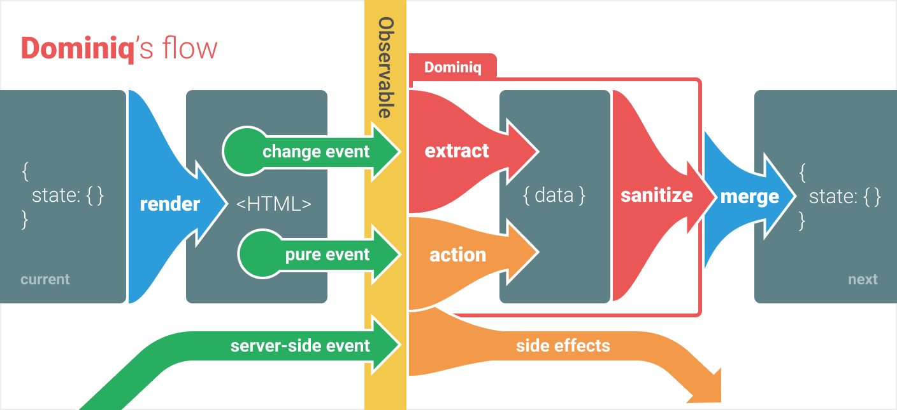

# Motivation

## No more syntax sugar for event handlers

See this example below:

```javascript
import {html} from 'lit-html/lib/extended'
export default state => html`
  <h1>Hello ${state.first}!</h1>
  <input name="first" value="${state.first}"
    on-change="${e => changeFirst(e.target.value)}">
  <input name="last" value="${state.last}"
    on-change="${e => changeLast(e.target.value)}">
  <button name="submit"
    on-click="${e => click()}">Click me!</button>
`

function changeFirst (value) {...}
function changeLast (value) {...}
function click (value) {...}
```

With React, vue and etc., we've put handlers in our view file. But, is it really the right approach? I have doubt about it these few years. I don't like these points at least:

- It makes the code long and dirty.
- It needs some logic in the view.

## Rethink the good old event model in browsers

Bubbling-up event model were not the everyone's favorite. A typical source code was flooded with `e.stopPropagation()` and `e.preventDefault()`. But, wait, wait. Rethink about it. Which looks simpler?

```html
// Example A
<form>
  <input name="first" onchange="...">
  <input name="second" onchange="...">
  <input name="third" onchange="...">
</form>
```

Or:

```html
// Example B
<form onchange="...">
  <input name="first">
  <input name="second">
  <input name="third">
</form>
```

Absolutely, latter seems clean. The point is that *we can handle all events at the top!* So, we don't have to write handlers inside the view file. Remember that it also works fine with `document.body.addEventListener('change', ...)`:

```html
// Example C
<body>
  <form>
    <input name="first">
    <input name="second">
    <input name="third">
  </form>
</body>
```

## Define the data in a declarative way

Rendering process are a pure function typically. The same state creates the same rendered result. It should be true for extracting the data back from the DOM. It means that *how to extract data* should be **defined in HTML** by itself. Basically, `name` and `value` attributes are the basic keys for this purpose.

```
State --> Rendered DOM --(User editing)--> Changed DOM --> Extracted data --> State
```

The state includes unchanged variables which users can't access. We don't have to extract such a value. What we want to hadle as "data" is what user can interact with: for example, text fields, radio buttons and so on. Tha data is a partial state, so we can merge it back to the state again.


